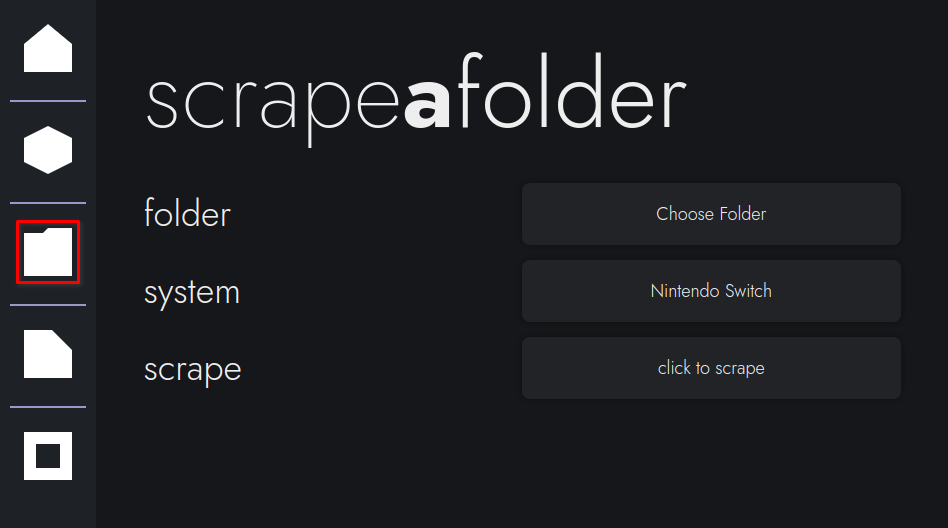
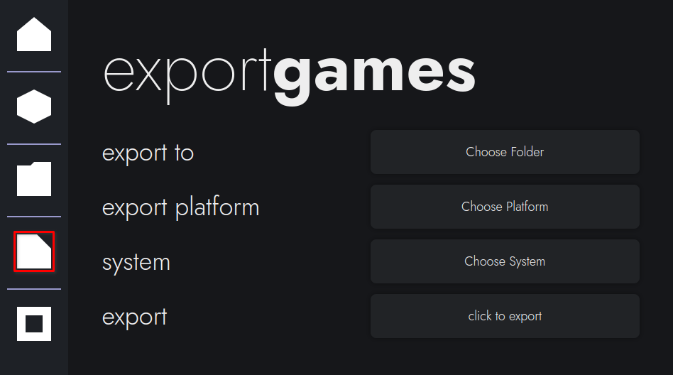

# bigscraper-gui Guide

- [2-step Starter Guide](#2-step-starter-guide)
- [Scraping 1 Game](#scrape-1-game)
- [Scraping Several Games](#scrape-several-games)
- [Exporting Games](#export-games)
- [Metadata Storage in bigscraper](#metadata-storage)

## 2-step Starter Guide

This will be a 2-step starter guide to scrape metadata, serving as an example. Here, we will scrape metadata for 4 Switch Games.

To get started, ensure all 4 games are in a single folder, ordered like so. Ensure that each game is an actual ROM, not a text file or image, and that each game has the full title listed, without abbreviations. An example of what this folder could look like is below.

```
example-folder
|
| Animal Crossing - New Horizons (01006F8002326000) (BASE).nsp.nsp
| Mario Kart 8 Deluxe (0100152000022000).xci
| Super Mario Party.xci
| SUPER MARIO ODYSSEY (0100000000010000).xci
```

Now that you have a list of games, let's begin. Start by navigating to the "scrape a folder" page in bigscraper. This should look like below:



Click the "Choose Folder" button and pick the folder your games are in. Then, click the "Choose System" folder and pick "Nintendo Switch." Finally, click "click to scrape" to begin gathering metadata.

Once you begin scraping, you will be notified of the progress being made. Depending on your internet speed, this may take a while. Also note that **all images per game** are downloaded, meaning that **storage will be filled up if you have lots of games.**

Upon completion, you will be kicked back to the scrape a folder screen after being notified "Process Complete." You should now go to the "export games" page, which looks like below.



This page has 3 configuration options instead of 2, so let's walk through them.

First, the "Choose Folder" button picks an output folder to scrape to. For this example, we will pick the same folder that our games are stored in. By default, it stores the output in (Documents)/bigscraper/output.

Next, the "Choose Platform" button chooses the export platform. In this example, we will export to Pegasus, so click that option.

Finally, the system option chooses which system we will export. As we are scraping switch games, choose "Nintendo Switch" again.

Now, you can start exporting the metadata. This copies the relevant metadata and images over to the location specified, putting it in a format used by other frontends. It may take a few seconds to finish up, and the app may look stuck; the app, however, typically isn't stuck.

After you are kicked back to the exports page, the scraping is done. You now have game metadata for the switch games you have in that folder. It should now look like below.

```
example-folder
|
└───media
|	|
|	└───boxFront
|	|	|	Animal Crossing: New Horizons - Box - Front.png
|	|	|	Mario Kart 8 Deluxe - Box - Front (North America).png
|	|	|	...
|	|
|	└───background
|	|	|...
|	|
|	└───gameplay
|	|	|...
|	|
|	└───logo
|	|	|...
|	|...
|
|	metadata.pegasus.txt
|	Animal Crossing - New Horizons (01006F8002326000) (BASE).nsp.nsp
|	Mario Kart 8 Deluxe (0100152000022000).xci
|	Super Mario Party.xci
|	SUPER MARIO ODYSSEY (0100000000010000).xci
```

## Scrape 1 Game


## Scrape Several Games


## Export Games


## Metadata Storage

Metadata is stored in bigscraper through JSON files, located in the app's config folder. This is found in one of several locations, depending on your installation:

- Linux (General): ~/.config/bigscraper-gui/storedMeta
- Linux (Flatpak): ~/.var/app/io.github.fr75s.bigscraper_gui/config/bigscraper-gui/storedMeta

The storedMeta folder contains all metadata. It separates the metadata into 2 parts, located in cache and images. Each of these contains several subdirectories for each system scraped.

The cache's system folders contain the JSON files with metadata for each game. Each JSON file stores the following information, some of which may not be present depending on the game:

- File location
- Name
- Platform
- Release Date
- Game Type
- ESRB Rating
- Developers
- Publishers
- Genres
- # of Players
- Is Cooperative
- Rating (decimal number from 0-5)
- Wikipedia Link
- Video Link
- Overview
- Image Titles

All of these data points (except the file location) are located in lists, allowing for multiple entries per attribute.

