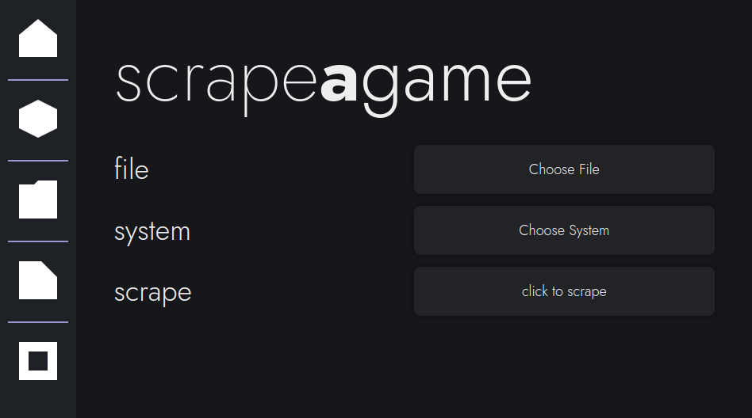
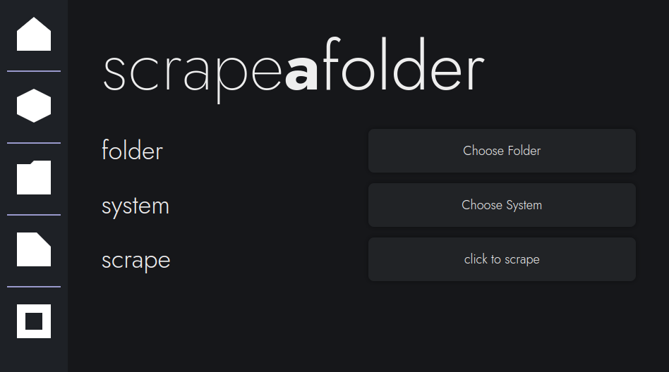
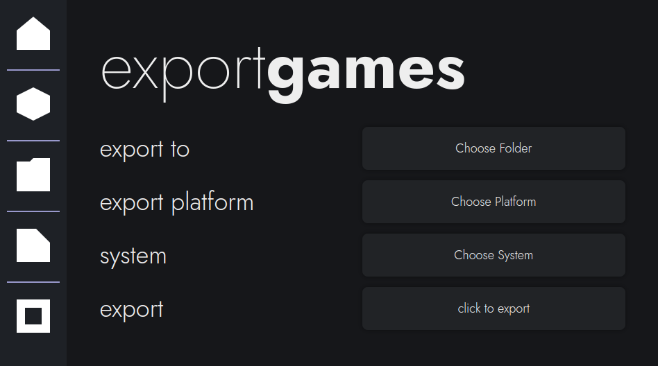

# bigscraper-gui Guide

- [2-step Starter Guide](#2-step-starter-guide)
- [Scraping 1 Game](#scrape-1-game)
- [Scraping Several Games](#scrape-several-games)
- [Exporting Games](#export-games)
- [Launch Commands](#launch-commands)
- [Metadata Storage in bigscraper](#metadata-storage)

## 2-step Starter Guide

This will be a 2-step starter guide to scrape metadata, serving as an example. Here, we will scrape metadata for 4 Switch Games.

To get started, let's put our 4 example games like below in 1 folder.

```
example-folder
|
| Animal Crossing - New Horizons (01006F8002326000) (BASE).nsp.nsp
| Mario Kart 8 Deluxe (0100152000022000).xci
| Super Mario Party.xci
| SUPER MARIO ODYSSEY (0100000000010000).xci
```

Now, navigate to the "scrape a folder" page in bigscraper, like so.


Click the "Choose Folder" button and select the folder your games are in. Then, click the "Choose System" button and select "Nintendo Switch." Now, click the "click to scrape" button to begin downloading each game's metadata and images.

Once it is done, go to the "export games" page, shown below.


This page has 3 configuration options instead of 2, so let's walk through them.

Click the "Choose Folder" button and select the folder your games are in. Then, click the "Choose Platform" button and select "Pegasus." Then, click the "Choose System" button and select "Nintendo Switch." Now, click the "click to export" button to export the scraped data to your games folder.

Once it is done, your folder should look like below:

```
example-folder
|
└───media
|	|
|	└───boxFront
|	|	|	Animal Crossing: New Horizons - Box - Front.png
|	|	|	Mario Kart 8 Deluxe - Box - Front (North America).png
|	|	|	...
|	|
|	└───background
|	|	|...
|	|
|	└───gameplay
|	|	|...
|	|
|	└───logo
|	|	|...
|	|...
|
|	metadata.pegasus.txt
|	Animal Crossing - New Horizons (01006F8002326000) (BASE).nsp.nsp
|	Mario Kart 8 Deluxe (0100152000022000).xci
|	Super Mario Party.xci
|	SUPER MARIO ODYSSEY (0100000000010000).xci
```

Now, you should enter metadata.pegasus.txt, and put in the launch command for your switch emulator. **Bigscraper does not define a launch command by default.** Depending on the install and emulator, it will be one of these:

- Yuzu (flatpak): `org.yuzu_emu.yuzu "{file.path}"`
- Ryujinx (flatpak): `org.ryujinx.Ryujinx "{file.path}"`
- Generic (includes AppImages): `[path_to_emulator_binary] "{file.path}"`

(NOTE: More folders are here than displayed.)

## Scrape 1 Game

Scraping 1 Game is easy. The screen which allows you to scrape games is accessible with the 2nd icon from the top on the left bar.



This gives 2 options for scraping games.

The first option lets you pick a file. Any file will work, but it has to contain the full name of the game to scrape properly. Most variations of the file name should work: if your file name doesn't work, please let me know.

The other option lets you pick the system. This is important, as it determines which pages bigscraper will search for your game. Ensure that the system chosen has your game.

Then, you may use the last button to scrape.

## Scrape Several Games

Scraping a folder of games is only slightly more challenging. Scraping a folder is accessible through the center icon on the left bar.



The first option here lets you choose the game folder. This will select all the files in the folder, ignoring subfolders and files with certain (or no) extensions:

- txt
- jpg
- png
- sav
- srm
- cue

The other option here lets you choose a system. Similarly to scraping 1 game, choose the system that corresponds to all of the games in the selected folder. **Each game in 1 folder should belong to the same system.**

Now, you can start scraping. When scraping a folder, bigscraper scrapes each game simultaneously.

## Export Games

Exporting games is simple, though there is now an extra option.



The 1st option here lets you pick the folder to export to. Bigscraper will write the output document and copy images to this folder (images are copied to the media subfolder).

The 2nd option here lets you choose the output format. Based on the frontend you use, you will want to choose on of the options available.

The 3rd option here lets you choose the system to export. This exports all the data collected for that system to the chosen folder.

Once you click the bottom button, all data will be copied over to the chosen folder.

## Launch Commands

After you export your games, **be sure to edit the launch command**. Pegasus does not define a specific launch command for systems, and this needs to be manually implemented. This guide specifies launch commands for Linux. On other platforms, use the standalone emulator guide, replacing the single commands with paths to executables (e.g. `dolphin-emu` becomes `C:\...\Dolphin.exe`);

Launch commands depend by system, and you may need to do some searching up for more obscure systems. For most systems, however, it usually boils down to the following:

### Emulator Flatpak

If you installed your emulator through flatpak, it is relatively easy for you to create a launch command. Typically, it is as follows.

`[app-id-of-emulator] {file.path}`

Examples of this are below.

- Yuzu: `org.yuzu_emu.yuzu {file.path}`
- Ryujinx: `org.ryujinx.Ryujinx {file.path}`
- Citra: `org.citra_emu.citra {file.path}`

In some cases, you may need flags. See [standalone emulators](#standalone-emulators) below.

### Retroarch

If you're emulating games through retroarch, be aware that there are several flags needed. It should be as follows, depending on your retroarch install.

- Standard: `retroarch -f -L [path-to-cores] {file.path}`
- Flatpak: `org.libretro.Retroarch -f -L [path-to-cores] {file.path}`

The `[path-to-cores]` in this case specifies the path to the retroarch core. On a typical Linux system, these are found in the following folders. Remember to convert `~` to the absolute path with your command (`/home/[user]`)

- Standard: `~/.config/retroarch/cores`
- Flatpak: `~/.var/app/org.libretro.Retroarch/config/retroarch/cores`

A few example paths are below for some cores. Replace `[path-to-cores]` with one of the ones displayed above, and replace retroarch with `org.libretro.Retroarch` if you're using the Retroarch flatpak.

- mgba: `retroarch -f -L [path-to-cores]/mgba_libretro.so`
- bsnes HD: `retroarch -f -L [path-to-cores]/bsnes_hd_beta_libretro.so`
- Handy: `retroarch -f -L [path-to-cores]/handy_libretro.so`

### Standalone Emulators

Standalone emulators vary wildly depending on the emulator. These may require certain flags and other command line configurations to make them work. Most don't however.

You can find necessary flags by hopping in a terminal and typing the command for the emulator (or app id if a flatpak) with the flag -h (e.g. `dolphin-emu -h`).

For most standalone emulators (including single executables, binaries and AppImages), it goes like this:

`[absolute-path-to-emulator] {file.path}`

This works well as a starting point, and is fine for most emulators. For some emulators (such as the aforementioned Dolphin), this isn't enough.

I will provide a few examples for standalone emulators below.

- Dolphin: `dolphin-emu -b -e "{file.path}"`
- PPSSPP: `PPSSPPQt {file.path}` for Qt, `PPSSPPSDL {file.path}` for SDL

## Metadata Storage

Metadata is stored in bigscraper through JSON files, located in the app's config folder. This is found in one of several locations, depending on your installation:

- Linux (General): ~/.config/bigscraper-gui/storedMeta
- Linux (Flatpak): ~/.var/app/io.github.fr75s.bigscraper_gui/config/bigscraper-gui/storedMeta

The storedMeta folder contains all metadata. It separates the metadata into 2 parts, located in cache and images. Each of these contains several subdirectories for each system scraped.

The cache's system folders contain the JSON files with metadata for each game. Each JSON file stores the following information, some of which may not be present depending on the game:

- File location
- Name
- Platform
- Release Date
- Game Type
- ESRB Rating
- Developers
- Publishers
- Genres
- # of Players
- Is Cooperative
- Rating (decimal number from 0-5)
- Wikipedia Link
- Video Link
- Overview
- Image Titles

All of these data points (except the file location) are located in lists, allowing for multiple entries per attribute.

As for images, all images for each game are typically stored, no matter the type. This includes the following types of images (note that some may not be present in some games):

- Front Box Art
- Back Box Art
- 3D Box Art
- Clear Logo
- Marquee
- Gameplay Screenshot
- Title Screen Screenshot
- Game Art
- Physical Media (Disc/Cartridge)

While all types of images are stored, only some are exported, mostly based on the type or region of the image.

